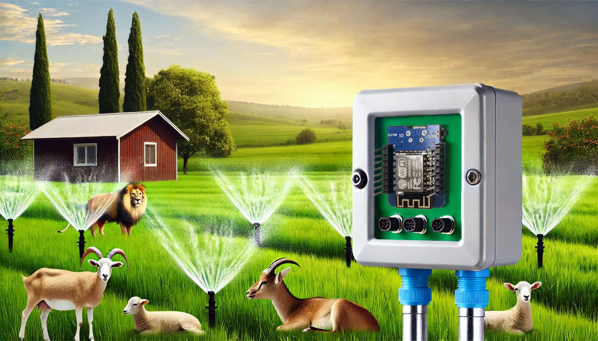

# ESP8266 Sprinkler Controller

### *Disclaimers

* *I just got this project to the point of its main functions, and put it to use!*
* I had ChatGPT write this README and I've only given it a cursory review and one or two ChatGPT revisions. :)

## Overview

This project is an **Arduino+ESP8266-based** sprinkler controller that allows you to manage multiple irrigation zones using a simple, web-based interface. Unlike other solutions that require external services like Home Assistant or complex smart home integrations, this project keeps things **local** and **simple**:

- **No reliance on external platforms**—it works entirely over your home network.
- **Dynamic configuration**—set the pin assignments, zone names, and even presets for each sprinkler zone via the web interface.
- **Simple API**—control the sprinkler zones from anywhere on your local network (or beyond, with proper network setup) using simple HTTP commands.

Once WiFi is configured, the device will **stay connected to your network** and will not revert to offering an access point unless the settings are wiped manually (reflashing is required for now). This ensures stability in day-to-day operation without unexpected mode switches.

## Features

- **WiFi-based control**: The ESP8266 connects to your home WiFi network, allowing you to control the sprinkler zones from any device via a browser or scriptable HTTP API.

- **Dynamic zone configuration**: Set up each zone with a specific GPIO pin and a custom name directly from the web interface. This means you can reassign zones without having to recompile or reflash the code.

- **Multiple presets**: For each zone, you can configure preset durations that allow you to quickly activate them for pre-set periods (e.g., water a zone for 30, 60, or 120 seconds).

- **Persistent configuration**: All network and zone settings (pins, names, etc.) are stored using LittleFS, so your configurations persist across reboots.

- **Simple Web API**: You can control the zones programmatically via HTTP requests. For example:
  - `GET /on?zone=0&duration=30` turns on zone 0 for 30 seconds.
  - `GET /off?zone=0` turns off zone 0.

- **Basic security**: Configurable password protection for the settings page.

- **Web interface**: A responsive web interface allows you to easily view zone statuses, activate them, and adjust settings from any web browser.

## Setup and Usage

1. **Flash the ESP8266**: Upload the project code to your ESP8266 using the Arduino IDE.
2. **Configure WiFi**: On first boot, the device will open an access point (AP) with the SSID `ESP_Sprinkler_Config`. Connect to it and follow the instructions to join your home WiFi network.
3. **Set up zones**: Once connected to WiFi, use the web interface to assign GPIO pins to your sprinkler zones and set custom names for each zone.
4. **Control the zones**:
   - Visit the root page of the web interface to see the status of each zone.
   - Turn zones on or off directly through the web interface or by sending HTTP requests for more programmatic control.

## Limitations

- **No automatic fallback to AP**: Once WiFi is configured, the device will not revert to AP mode in case of a network change or forgotten credentials. If you change your SSID or lose your WiFi password, you will need to reflash the device.

- **No wipe/reset feature**: Currently, there is no way to wipe or reset the network settings from the web interface. You’ll need to manually reflash the device if you want to change the WiFi credentials.

- **Basic API security**: The web-based API does not have robust security features yet, so ensure your network is secure if you plan on exposing this controller to external networks.

- **Limited error handling**: If invalid zone or duration values are sent via the API, the response is limited to basic error messages. There is no advanced error recovery system yet.

## Future Improvements

- **WiFi reset feature**: Implement a way to wipe the WiFi credentials from the web interface, allowing users to reset the WiFi settings without needing to reflash the ESP8266.
  
- **Enhanced API security**: Add API keys or token-based authentication to improve the security of remote HTTP-based control.

- **Scheduling and automation**: Add a feature to allow users to schedule watering times, so zones can be automatically activated at specific intervals or times of day.

- **Improved time synchronization**: Fully enable and integrate the time server feature for accurate time-based scheduling of zones.

- **Cloud integration**: Optionally allow integration with cloud platforms like Home Assistant or other IoT services for users who want more complex automation options.

## How it Works

### Dynamic Configuration

The web interface allows you to assign any available GPIO pin to a specific sprinkler zone, and you can give each zone a name for easier identification. You can also configure preset durations for each zone, allowing you to quickly activate a zone for pre-set periods.

### Local Network Control

Once the ESP8266 is connected to your WiFi network, you can control it locally via HTTP. The device does not need an internet connection, making it ideal for local network setups where simplicity and control are prioritized.

### Web-based API

The API supports basic control of each zone through simple `GET` requests:
- `/on?zone=X&duration=Y`: Turns on zone `X` for `Y` seconds.
- `/off?zone=X`: Turns off zone `X`.

This API allows easy scripting and integration with home automation tools that can send HTTP requests.

---

Feel free to customize and expand the features as needed, and enjoy the flexibility of a truly local, self-hosted irrigation system!
